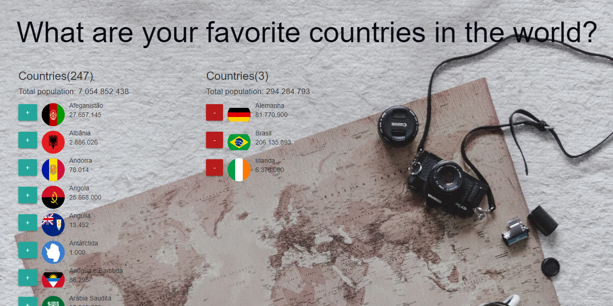

<h1>Favorite-Country</h1>

Activity using JS, CSS and HTML to access a API and to create a list of countries and population. 

<ol>
  <li>By clicking on + button, you can add countries to the Favorite Countries, removing them from the original list.</li>
  <li>By clicking on - button, you can remove coutries from the Favorite Countries, reinserting them to the original list.</li>
</ol>

<h2>Result</h2>

